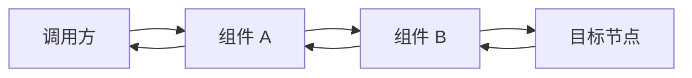
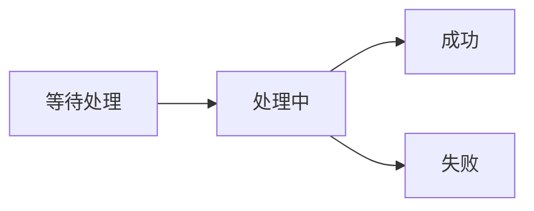
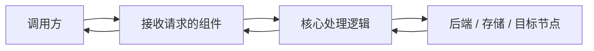
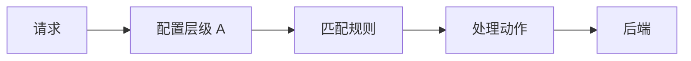
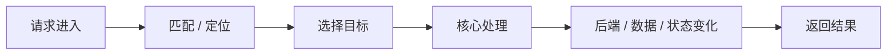
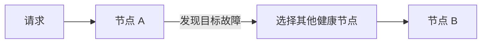
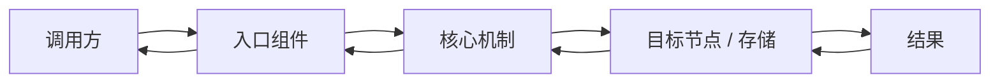

我想快速认识【学习主题】。请写一篇面向后端开发初学者的技术概览，帮助我在较短时间内建立整体认知，以便后续阅读技术文章、官方文档或准备面试。

文章的目标不是一次讲透所有细节，而是建立一张准确、清晰、可继续扩展的“知识地图”。

## 核心目标

读完后，我至少应该能够回答：

- 它到底是什么，最准确的一句话定义是什么。
- 它在一个真实系统中通常处于什么位置。
- 它主要解决哪些问题，又不负责解决哪些问题。
- 最核心的组件、概念和配置分别是什么。
- 这些概念之间是什么关系。
- 一次典型请求或操作从进入到结束是怎么运行的。
- 当出现多个节点、故障、高并发等情况时，它如何处理。
- 它为什么这样设计，优势和代价分别是什么。
- 如果面试官问“你了解它吗”，我应该掌握到什么程度。
- 后续还可以沿哪些问题继续深入。

重点是让我真正理解：

**它在系统中的位置是什么，以及一次真实请求、数据或状态到底是如何在这些组件之间流转的。**

不要把文章写成功能列表、术语词典或配置手册。

## 专业程度

保留必要的正式技术术语，并保证定义准确。

核心术语第一次出现时，尽量按照下面顺序说明：

1. 中文名称 + 英文名称。
2. 用一句话给出专业定义。
3. 必要时再补一句容易理解的解释。
4. 说明它在整个系统中的作用。
5. 如果容易和另一个概念混淆，顺手指出最关键区别。

例如，不要只说“它负责转发”，而要明确区分：

- 反向代理是谁重新向后端发起请求。
- 重定向是谁重新发起下一次请求。
- 负载均衡是在什么候选节点之间做选择。

不要只用比喻代替正式术语，也不要为了显得专业堆砌定义。

## 内容组织原则

必须按照“概念依赖关系”逐层递进，而不是先罗列几十个功能。

整体思路优先按照：

技术定位  
→ 最小工作模型  
→ 核心组件与概念  
→ 一次典型请求 / 操作  
→ 关键能力如何实现  
→ 多节点与复杂场景  
→ 故障与可靠性  
→ 为什么这样设计  
→ 使用边界  
→ 面试认知  
→ 后续深入方向

始终遵守一个原则：

**先建立能够运行的最简单模型，再因为新问题的出现，引入新的机制。**

例如：

单节点已经能够解释正常请求时，就不要提前引入集群。

只有当单节点出现性能、容量或可用性问题时，再解释为什么需要：

- 多实例；
- 负载均衡；
- 副本；
- 分片；
- 健康检查；
- Leader；
- 缓存；
- 持久化；

等能力。

不要为了套模板强行加入与该技术无关的副本、分片、Snapshot、Leader、选举等概念。

判断一个概念是否应该进入第一篇文章时，可以问：

**如果删掉这个概念，是否仍然能够正确理解这个技术的核心工作原理？**

如果答案是“可以”，就先不要展开。

## 流程图使用原则

凡是需要描述以下内容时，优先使用 Mermaid，而不是代码块中的纯文本箭头：

- 请求链路；
- 数据流；
- 消息流；
- 状态变化；
- 节点之间的交互；
- 正常操作流程；
- 故障后的切换过程；
- 多个组件之间的调用关系。

默认优先使用横向流程图：

即优先使用：

`flowchart LR`

而不是纵向的 `flowchart TD`。

原因是本文主要用于建立系统调用链和组件关系，横向流程更容易形成：

**入口 → 处理 → 目标 → 返回**

这样的整体认知。

如果是状态变化，也尽量使用横向流程表达，例如：

只有当 Mermaid 明显不能帮助理解时，才使用简单文字关系式。

不要为了排版方便，把普通解释全部放进代码块。

### Mermaid 图的额外要求

每张 Mermaid 图都必须满足：

- 只使用前文已经定义或紧接着会解释的术语。
- 节点名称简短，不在图中塞入大段解释。
- 一张图只表达一个核心问题。
- 主流程尽量从左向右。
- 正常流程使用实线即可，不必加入复杂样式。
- 除非确实有必要，不使用颜色、图标、复杂 subgraph 或样式配置。
- 不要为了“看起来完整”画出大量旁支。
- 图画完以后必须用自然语言解释关键节点之间到底发生了什么。

流程图是为了降低理解成本，而不是替代正文。

## 重要写作原则

不要把“功能”直接当成“定义”。

例如某个技术既能做代理、路由、负载均衡，也不要简单定义成：

“它就是一个网关。”

或者：

“它就是一个路由器。”

应该先给出业界最准确、最基础的技术定位，再说明它在实际架构中可能承担哪些职责。

对于容易混淆的行为，要主动回答下面这些问题：

- 是谁发起了最初的请求？
- 中间组件是否重新发起了新的请求？
- 请求和响应分别经过谁？
- 客户端是否知道真实目标？
- 数据或状态实际保存在哪里？
- 真正执行核心处理的是谁？
- 某个组件只是负责选择目标，还是自己完成业务处理？

这些问题往往比单纯罗列功能更有助于建立正确模型。

---

## 1. 它是什么

控制在 3～5 个自然段。

开头先给出一个适合技术交流或面试直接使用的一句话定义。

然后说明：

- 它的专业定位是什么；
- 在系统中一般部署在哪里；
- 核心解决什么问题；
- 最主要的 2～4 个使用场景；
- 哪些问题并不属于它负责的范围。

如果某个常见说法容易产生误解，例如：

“它是不是网关？”
“它是不是数据库？”
“它是不是注册中心？”

可以简短澄清。

这一节只建立定位，不展开内部实现。

## 2. 最小工作模型

先抛开集群、高可用、性能优化等问题，只保留理解它所必需的最少组件。

使用一张简洁的横向 Mermaid 图描述最基本的工作模型，例如：

具体生成文章时，节点名称必须替换成当前技术真正使用的正式术语。

不要保留“组件 A”“核心处理逻辑”之类的占位名称。

随后用 2～4 个自然段解释：

- 谁先收到请求；
- 谁真正执行核心工作；
- 谁负责选择目标；
- 谁保存数据或状态；
- 是否产生新的网络请求；
- 响应最终通过谁返回。

这一节的目标是让我首先建立：

**“一次请求到底是怎么走的”**

这张最基础的心智模型。

## 3. 核心概念与关系

按照理解顺序介绍最重要的概念。

每个概念重点回答三个问题：

- 它是什么；
- 它负责什么；
- 它和前面已经出现的概念是什么关系。

优先介绍真正处于主流程中的概念。

如果属于配置型技术，需要把最重要的配置层级或核心配置串起来，而不是只介绍抽象架构。

例如最终应该能够形成类似：

这样的主链路。

如果多个同级概念确实适合比较，可以使用一张简短表格。

不要写成术语词典。

## 4. 一次典型操作如何完成

选择最能代表该技术核心能力的一次正常请求或操作。

先使用一张横向 Mermaid 图概括完整执行顺序，例如：

实际文章中必须替换成该技术真实存在的组件和动作。

然后严格按照真实执行顺序解释。

必须把前面介绍过的概念真正串起来。

重点回答：

**运行时到底发生了什么。**

不要重新逐个解释定义。

这一节只讲正常主流程，不展开所有异常分支。

## 5. 主要能力如何实现

只选择 2～4 个：

**最能体现该技术价值，同时初学者最容易产生疑问的能力。**

不要只说：

“它支持 XXX。”

而要解释这个能力大概是如何工作的。

例如根据不同主题，可以说明：

- 静态资源实际存在哪里，由谁读取；
- 反向代理是谁向真正后端重新发起请求；
- 负载均衡如何从多个候选节点中选择目标；
- 缓存数据实际存在哪里，什么时候命中；
- 消息如何从生产者走到消费者；
- 服务发现时，消费者如何找到真实实例；
- 配置变化后，是谁保存、谁通知、谁加载。

如果其中某个能力涉及明确流程，优先再使用一张简洁的横向 Mermaid 图。

对于负载均衡、路由、缓存等机制，只介绍最重要的几种策略，以及每种策略主要解决什么问题。

不要在这里塞入大量高级参数。

## 6. 可靠性与扩展

只讨论与这个技术真正相关的问题。

按照问题逐步出现的顺序解释：

### 后端节点故障

先回答：

它依赖的目标节点或后端节点挂了怎么办？

如果涉及健康检查，要明确区分：

- 主动健康检查；
- 被动健康检查。

### 自身节点故障

再回答：

这个技术自己所在的节点挂了怎么办？

特别强调：

**能够处理后端节点故障，并不代表这个技术自己天然就是高可用的。**

如果需要多个实例才能解决单点问题，要明确说明。

### 性能或容量不足

最后回答：

单节点性能、连接数、存储容量或吞吐量不够时如何扩展？

如果涉及多实例，要区分：

- 单个进程内部的多线程 / 多 Worker；
- 同一机器上的多个进程；
- 真正部署在多台机器上的多个节点；
- 集群内部的数据复制或状态同步。

如果涉及：

- 副本；
- 备份；
- 持久化；
- 日志；
- Snapshot；

必须明确说明它们分别解决什么问题，不能混为一谈。

如果故障处理过程涉及多个组件，可以使用 Mermaid，例如：

明确指出仍然存在的：

- 单点；
- 状态同步；
- 配置同步；
- 一致性；
- 扩展瓶颈；

等限制。

## 7. 为什么这样设计

选择 2～4 个真正关键的设计机制解释。

不要停留在：

“因为用了内存，所以快。”

“因为用了异步，所以性能好。”

要继续回答：

- 减少了什么开销；
- 避免了什么阻塞；
- 为什么适合大量并发；
- 为什么适合这种工作负载；
- 为什么要把控制逻辑和请求处理分开；
- 为什么要把流量处理和业务逻辑解耦；
- 为什么某些状态选择保存在内存，而另一些必须持久化。

同时说明这些设计带来的代价。

这一节应该体现：

**为什么它不是随便设计成这样的。**

## 8. 容易混淆的概念

最多选择 5 组真正容易导致理解错误的概念。

使用表格：

| 概念 | 主要作用 | 最关键区别 |
|---|---|---|

只解释区别，不重复完整定义。

优先选择会直接影响主流程理解的概念，而不是生僻术语。

例如可能包括：

- 正向代理 vs 反向代理；
- 反向代理 vs 重定向；
- 路由 vs 负载均衡；
- 副本 vs 备份；
- 缓存 vs 持久化存储；

但必须根据具体学习主题选择，不能机械套用。

## 9. 面试中需要掌握到什么程度

从“普通后端开发面试”的角度回答。

首先给出一个 **30～60 秒可以直接说出口的回答**，用于应对：

“你了解【学习主题】吗？”

这个回答应该包含：

- 准确定位；
- 核心用途；
- 主请求链路；
- 最重要的几个核心概念；
- 一句关键设计特点。

不要一开始就讲高级源码细节。

然后分成三个层次：

**必须掌握**

普通后端工程师应该能够讲清楚的内容。

**最好掌握**

继续追问时比较常见的原理或生产实践。

**深入岗位才需要掌握**

源码、极端故障、复杂性能优化、协议细节等。

不要把这一节写成几十道题的大型面试题库。

## 10. 面试官可能如何继续追问

本节不要使用代码块，不要使用 Mermaid，也不要做成编号问题列表。

使用简洁的一问一答形式：

> 什么叫 XXX？

一句到两句话回答。

> XXX 和 YYY 有什么区别？

一句到两句话回答。

控制在 6～10 个问题以内。

每个问题只引出一个延伸知识点，不展开完整教学。

问题优先围绕前文主链路，例如：

- 核心机制是什么；
- 两个容易混淆的概念有什么区别；
- 数据或资源实际在哪里；
- 多个节点如何选择；
- 节点故障怎么办；
- 为什么性能比较好；
- 它自己挂了怎么办；
- 真实项目中通常如何使用。

这一节应该像一张：

**“面试追问地图”**

而不是重复正文。

## 11. 整体认知图

使用一张横向 Mermaid 图，把全文已经介绍过的核心概念重新收拢起来。

例如结构上类似：

实际文章中必须使用真实术语。

只允许使用前文已经解释过的概念。

不要在这里引入任何新术语。

这张图应该让我即使忘记细节，也能够重新回忆：

- 请求从哪里进入；
- 经过哪些核心组件；
- 谁执行关键工作；
- 数据或状态在哪里；
- 最终去了哪里；
- 响应如何返回。

## 12. 第一阶段记忆卡

总结不超过 8 条。

每条必须是一条值得真正记住的“结论”，而不是单纯术语定义。

读完这些内容以后，我应该能够大致讲清：

- 它是什么；
- 它处于系统什么位置；
- 核心组件是什么；
- 一次请求如何完成；
- 多节点如何工作；
- 故障如何处理；
- 为什么它具有某些性能或设计优势；
- 它的使用边界在哪里。

## 13. 后续深入方向

列出 5～8 个适合后续单独学习的问题。

只写问题，不展开答案。

优先选择：

- 实现原理；
- 性能机制；
- 高级配置；
- 故障场景；
- 高可用；
- 生产实践；
- 源码实现。

不要和正文已经完整回答的问题重复。

## 资料来源

优先参考当前版本的：

1. 官方文档；
2. 官方规范；
3. 官方维护者提供的技术资料。

文末只列出 3～5 个最重要的官方资料。

不要为了每一句普通定义都添加引用，避免影响阅读。

如果存在：

- 不同版本差异；
- 开源版与商业版差异；
- 新旧架构差异；
- 已废弃与当前推荐方案差异；

必须明确指出，不能混在一起描述。

## 篇幅限制

正文控制在约 3000～4000 个汉字。

阅读时间尽量控制在 10～15 分钟以内。

Mermaid 图原则上控制在 **3～5 张以内**。

只有当流程、组件关系或状态变化确实需要可视化时才画图，不要每一节都强行加入。

正式对比表格最多 2 张。

完整业务案例最多 2 个，而且一个案例只解决一个理解难点。

每个二级章节尽量控制在 2～5 个自然段。

以下内容原则上不要在第一篇展开：

- 大段源码分析；
- 完整参数列表；
- 所有配置项；
- 极端故障场景；
- 非核心协议细节；
- 历史版本演进；
- 很少实际使用的高级功能。

这些内容放入“后续深入方向”。

写完以后主动检查并删除：

- 重复定义；
- 重复流程；
- 同一请求链路的多次重复描述；
- 没有帮助理解的过渡话；
- 只为了显得专业而加入的术语；
- 不影响整体认知的配置细节；
- 没有提供额外信息的 Mermaid 图。

## 输出格式

文档必须严格以下面的格式开头，其中【学习主题】替换为实际主题：

---
title: 学习主题
order: 1
---

头信息后直接开始正文。

不要输出一级标题。

正文直接从二级标题开始。

不要在头信息后再次重复文章标题。

使用标准 Markdown。

真正的：

- 命令；
- 代码；
- 配置文件；
- SQL；
- Shell；
- 配置片段；

才使用普通代码块。

涉及：

- 请求流程；
- 数据流；
- 状态变化；
- 组件调用；
- 节点交互；
- 故障切换；

时，优先使用 **横向 Mermaid 流程图 `flowchart LR`**。

普通概念解释、面试问题不要为了排版方便全部塞进代码块。

尤其是“面试官可能如何继续追问”部分，必须使用：

> 问题？

普通文本答案。

不要使用代码块或 Mermaid。

最终文章应该像一张经过资深后端工程师校对的入门知识地图：

- 定义准确；
- 技术定位清楚；
- 概念边界明确；
- 请求链路完整；
- 能够解释“它实际上是怎么工作的”；
- 能够区分“谁接收、谁选择、谁处理、谁保存状态”；
- 复杂机制都是因为前面的简单模型遇到了新的问题才被引入；
- 能够自然衔接后续技术文章、官方文档和面试追问。

最终优先级始终是：

**理解正确 > 主线清晰 > 工作流程完整 > 概念数量 > 高级细节。**