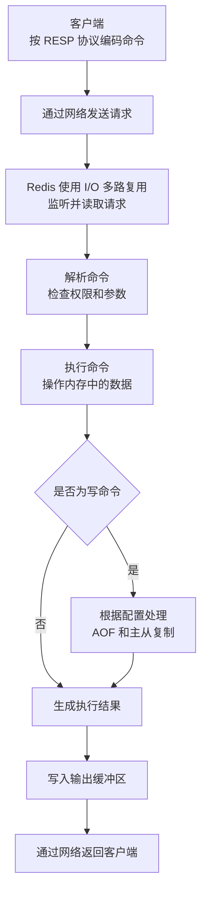

## Redis 是什么，它主要解决哪些后端系统问题？

Redis 是一个基于内存的高性能键值数据存储系统，并且支持字符串、哈希、列表、集合、有序集合等多种数据结构。它经常用来缓解关系型数据库在高并发、低延迟场景下的访问压力。常见用途包括缓存、分布式锁、计数器、排行榜、限流和会话存储。不过，缓存一致性、数据可靠性等问题不能只靠 Redis 本身解决，还需要结合具体业务进行设计。

> Redis 与传统关系型数据库的定位有什么不同？

关系型数据库更侧重数据的可靠持久化和结构化管理，支持复杂查询、事务以及主键、外键等数据约束。Redis 更侧重低延迟、高吞吐的读写，以及对集合、有序集合等特定数据结构的操作。

实际系统中，两者通常是互补关系：关系型数据库保存核心业务数据，Redis 用于缓存、计数器、排行榜等高性能场景。

> Redis 适合承担主数据库吗？

对于允许少量数据丢失，或者能够从其他数据源重建的数据，Redis 很适合。对于订单、账户余额等要求强事务、复杂查询和高可靠性的核心数据，Redis 通常只用来加速访问，不作为唯一的权威数据源。

> Redis 的高性能只是因为使用内存吗？

Redis 快主要得益于内存读写、高效的数据结构、命令主要由单线程串行执行，以及使用 I/O 多路复用处理大量连接。

> Redis 与应用进程内的本地缓存有什么区别？

本地缓存属于单个应用实例，多实例之间通常不共享；Redis 是独立部署的集中式缓存，可以被多个应用实例共同访问，但会多一次网络开销。

## Redis 常见的业务使用场景有哪些？

Redis 最常见的业务场景是缓存，用来降低数据库压力和接口延迟；除此之外，还常用于分布式锁、计数器、限流和排行榜等功能。

> 哪些场景适合使用缓存、分布式锁、计数器和排行榜？

读多写少、允许短暂不一致且数据可重建时适合使用 **缓存**；多个应用实例需要互斥操作同一资源时适合使用 **分布式锁**；需要高并发原子增减时适合使用 **计数器**；需要按照分数动态排序时适合使用 **排行榜**。

> 哪些数据不适合存储在 Redis 中？

体积很大的数据、访问频率低的冷数据，以及要求强事务、复杂查询和极高可靠性的核心业务数据，通常不适合只存储在 Redis 中。

> 如何判断一个业务是否真的需要引入 Redis？

要看系统是否真的存在数据库压力或低延迟需求，并判断性能收益能否覆盖缓存一致性、故障处理和运维复杂度；如果数据库已经能够满足要求，就没有必要引入 Redis。

> 使用 Redis 缓存会带来哪些新问题？

主要包括 **缓存与数据库不一致、缓存穿透、缓存击穿、缓存雪崩、热 Key 和大 Key** 等问题，因此引入 Redis 不等于系统一定会更稳定。

> Redis 发生故障时业务应该怎么办？

应用需要设置合理的 **超时、降级和限流策略**，避免请求长时间阻塞或全部压向数据库；重要数据还应保存在可靠的数据源中，使 Redis 故障后可以恢复或重建。

## Redis 支持哪些核心数据类型，各自适合解决什么问题？

Redis 最核心的五种数据类型是：**String**，适合缓存、计数器和分布式锁；**Hash**，适合存储对象及其字段；**List**，适合有顺序的数据和简单队列；**Set**，适合去重、交集和共同关注；**Sorted Set（ZSet）**，适合排行榜和按分数排序。除此之外，还有 **Bitmap** 用于签到或状态统计、**HyperLogLog** 用于近似去重计数、**GEO** 用于地理位置查询、**Stream** 用于消息流。面试时优先记住前五种即可。

> 存储一个对象时，应该选择 String 还是 Hash？

需要整体读写对象时可以使用 **String**；需要单独读取或修改对象字段时更适合使用 **Hash**。数据量较小时，两者的性能和内存差异需要通过实际测试判断。

> 为什么排行榜通常使用 Sorted Set？

Sorted Set 可以把用户作为成员、把积分作为分数，在更新积分的同时自动维护排序，并支持查询名次和指定排名范围。

## Redis 中键、值、过期时间和数据库编号之间是什么关系？

在 Redis 中，**数据库编号**表示一个逻辑键空间，客户端默认使用 0 号数据库；同一个键名可以存在于不同编号的数据库中。在同一个数据库里，**键是唯一标识**，每个键对应一个带有数据类型的值。**过期时间通常设置在键上**，键过期后，其对应的整个值都会被删除，而不是只删除值中的某个元素。数据库编号只是逻辑隔离，不是独立实例；Redis Cluster 通常只支持 0 号数据库。

> Redis 的键命名需要遵循哪些设计原则？

键名应该**含义清晰、层次明确且长度适中**，通常使用 `业务:对象:标识` 的形式，例如 `user:profile:1001`。同时要避免命名冲突、过长键名和在键中直接包含密码等敏感信息。

> 键到达过期时间后会立即被删除吗？

不一定。键在逻辑上已经过期，无法再被正常读取，但物理内存可能要等到惰性删除或定期删除执行时才会释放。

> TTL、惰性删除和定期删除分别是什么？

**TTL** 表示键剩余的生存时间；**惰性删除**是在访问键时检查它是否过期，过期后再删除；**定期删除**是 Redis 周期性抽查带过期时间的键并删除其中已过期的键。两种删除方式结合使用，在控制性能开销的同时清理过期数据。

> 为什么线上通常不建议依赖多个逻辑数据库进行业务隔离？

多个逻辑数据库仍然共享同一个 Redis 实例的内存、CPU、配置和故障范围，并不是真正的资源或权限隔离；同时 Redis Cluster 通常只支持 0 号数据库。因此，不同业务一般使用独立实例或通过规范的键前缀进行区分。

> 修改键的值会保留原来的 TTL 吗？

取决于使用的命令。直接使用 `SET` 覆盖键通常会清除原来的 TTL，而对 List、Hash 等数据结构进行内部元素操作通常不会影响整个键的 TTL，因此业务不能默认所有更新都会保留过期时间。

## 一条 Redis 命令从客户端发出到返回结果，内部经历了哪些环节？

一条 Redis 命令的处理流程可以概括为：**客户端按照 RESP 协议编码命令 → 通过网络发送给 Redis → Redis 使用 I/O 多路复用监听连接并读取请求 → 解析命令并进行权限、参数等检查 → 主线程执行命令并读写内存中的数据 → 写命令根据配置进入 AOF、主从复制等后续流程 → Redis 编码执行结果并通过网络返回客户端**。命令执行通常是串行的，因此慢命令或大 Key 操作可能阻塞后续请求；较新版本可以使用 I/O 线程处理部分网络读写，但主要命令执行仍由主线程负责。

> Redis 如何接收、解析并执行客户端命令？

Redis 通过 **I/O 多路复用** 监听客户端连接，读取并按照 RESP 协议解析命令，再进行权限和参数检查，随后由命令执行线程操作内存数据，最后把结果写入缓冲区并返回客户端。

> Redis 为什么使用单线程模型也能获得较高性能？

因为 Redis 主要操作内存，命令和数据结构都比较高效，单线程执行还能减少锁竞争和线程切换，再结合 I/O 多路复用处理大量连接，所以依然能够获得较高性能。

> Redis 6.0 之后的多线程主要用于处理什么工作？

主要用于处理 **网络 I/O**，例如读取请求和发送响应，减轻主线程的网络处理压力；命令执行仍主要由主线程串行完成，并没有变成多个线程同时操作数据。[Redis 官方说明](https://redis.io/tutorials/what-is-redis/)

> 为什么慢命令会阻塞其他客户端？

因为命令主要由单线程串行执行，一个耗时命令长时间占用执行线程时，后面的命令只能等待，所以线上要避免慢命令和大 Key 操作。

> Pipeline 能让 Redis 并行执行命令吗？

不能。Pipeline 只是把多个命令批量发送，减少网络往返次数；Redis 仍然主要按照顺序执行这些命令。

## Redis 的事件循环、I/O 多路复用和命令执行模型是如何协作的？

**事件循环**是整体调度中心，它通过 **I/O 多路复用**同时监听大量连接的可读、可写事件；连接可读时，Redis 读取并解析请求，再把命令交给执行线程操作内存数据；命令执行完成后，结果先写入输出缓冲区，等连接可写时再发送给客户端。三者的关系可以概括为：**I/O 多路复用发现事件 → 事件循环调度处理 → 主线程串行执行命令 → 事件循环返回结果**。因此，Redis 可以高效管理大量连接，但慢命令仍可能阻塞整个命令执行链路。

> I/O 多路复用解决了什么问题？

它让 Redis 使用少量线程同时监听大量客户端连接，只处理已经就绪的连接，避免为每个连接创建一个线程或阻塞等待；但它并不会让命令并行执行。

> 哪些操作可能阻塞 Redis 事件循环？

执行时间过长的命令可能阻塞事件循环，例如 `KEYS`、大范围查询、大 Key 删除、复杂集合运算和长时间运行的 Lua 脚本；持久化过程中的 `fork`、磁盘抖动等也可能造成延迟。

> 大 Key、复杂命令和大量客户端连接会如何影响延迟？

大 Key 会增加计算、网络传输和删除成本，复杂命令会长时间占用执行线程；大量**活跃连接**还会增加网络处理和缓冲区压力，导致请求排队和延迟上升，而大量空闲连接的影响通常相对较小。

> 使用 I/O 多路复用后，Redis 命令会并行执行吗？

不会。I/O 多路复用只是高效地发现哪些连接可以读写，命令仍主要由主线程串行执行。

> BLPOP 等阻塞命令会阻塞整个 Redis 吗？

通常不会。这类命令只会挂起当前客户端，等到有数据或超时后再恢复，不会一直占用命令执行线程；它与慢命令阻塞整个执行链路不是一回事。

## Redis 的过期键删除策略和内存淘汰策略有什么区别？

**过期键删除策略** 处理的是已经达到 TTL 的键，Redis 主要结合惰性删除和定期删除：访问键时发现已过期就删除，同时周期性抽查并清理过期键。

**内存淘汰策略** 处理的是 Redis 内存达到 `maxmemory` 上限、又需要写入新数据的情况，此时会按照配置从部分键或全部键中选择数据淘汰，例如 LRU、LFU、随机淘汰；如果配置为 `noeviction`，则拒绝会增加内存的写请求。

两者的核心区别是：**过期删除由 TTL 触发，内存淘汰由内存压力触发**。

> Redis 为什么不在键到期时立即删除所有过期数据？

为每个键单独设置定时任务，会增加时间管理和 CPU 开销；但如果只使用惰性删除，从不再访问的过期键可能长期占用内存。因此 Redis 采用**惰性删除 + 定期删除**，在 CPU 开销和内存回收之间取得平衡。

> `noeviction`、LRU、LFU、Random 和 TTL 策略分别是什么，应该如何选择？

- `noeviction` 表示不淘汰数据，内存不足时拒绝写入；
- **LRU** 优先淘汰最久未访问的数据，适合热点随时间变化的缓存；
- **LFU** 优先淘汰访问频率最低的数据，适合热点相对稳定的缓存；
- **Random** 随机淘汰，实现简单但命中率通常较差；
- **TTL** 优先淘汰剩余生存时间较短的键。

纯缓存场景通常选择 `allkeys-lru` 或 `allkeys-lfu`；不能接受 Redis 自动删除数据时选择 `noeviction`，并通过扩容和监控避免写入失败。

> 内存达到上限后，写请求可能出现什么结果？

如果配置了淘汰策略，Redis 会先淘汰部分键，释放出足够空间后继续执行写请求；如果使用 `noeviction`，或者没有符合条件的键可以淘汰，写请求会返回 OOM 错误，而读请求通常仍可继续执行。

> `allkeys` 和 `volatile` 类型的淘汰策略有什么区别？

`allkeys` 可以从所有键中选择淘汰对象，适合整个 Redis 都作为缓存的场景；`volatile` 只淘汰设置了过期时间的键，适合同时存放可淘汰数据和不可淘汰数据的场景。如果没有带过期时间的键可供淘汰，`volatile` 策略可能导致写请求失败。

> 如何避免内存淘汰误删重要数据？

不要把核心数据和可随时淘汰的缓存混在同一个 Redis 实例中，最好通过独立实例进行隔离；同时合理设置 TTL 和 `maxmemory-policy`，并监控内存使用量、淘汰键数量和写入错误，在达到上限前扩容或清理数据。

## Redis 的 RDB 和 AOF 持久化机制分别如何工作？

**RDB** 会在某个时间点生成 Redis 内存数据的完整快照，文件紧凑、适合备份和快速恢复，但宕机时可能丢失上一次快照之后的数据。

**AOF** 会把执行过的写命令追加到日志中，重启时通过重新执行这些命令恢复数据；它可以通过 `always`、`everysec` 等策略控制刷盘频率，通常数据丢失更少，但文件更大、磁盘开销更高，因此还需要通过 AOF 重写压缩文件。生产环境可以根据可靠性要求单独使用其中一种，也可以同时开启。

> RDB 与 AOF 在数据安全、恢复速度和运行开销方面有什么差异？

**RDB** 可能丢失上一次快照之后的数据，但文件较小、恢复较快，平时没有持续刷盘开销；**AOF** 的数据丢失窗口更小，但文件通常更大、恢复更慢，并且持续追加和刷盘会增加磁盘开销。[Redis 官方持久化文档](https://redis.io/docs/latest/operate/oss_and_stack/management/persistence/)

> AOF 的刷盘策略和重写机制会怎样影响数据丢失风险？

`always` 每次写入都刷盘，安全性较高但性能开销最大；`everysec` 每秒刷盘，通常最多丢失约一秒的数据；`no` 交给操作系统决定刷盘时机，性能较好但丢失窗口更难控制。AOF 重写主要用于压缩文件，本身不会改变刷盘策略，但重写期间会增加磁盘和内存压力。[Redis 官方持久化文档](https://redis.io/docs/latest/operate/oss_and_stack/management/persistence/)

> 同时开启 RDB 和 AOF 时，Redis 重启会优先使用哪种数据恢复？

Redis 通常优先使用 **AOF** 恢复，因为 AOF 记录的数据一般比 RDB 更完整、更新。[Redis 官方说明](https://redis.io/docs/latest/operate/oss_and_stack/management/persistence/#interactions-between-aof-and-rdb-persistence)

> AOF 重写会阻塞 Redis 正常处理命令吗？

重写主要由后台子进程完成，主线程可以继续处理命令；但创建子进程、写时复制以及大量磁盘 I/O 仍可能造成延迟和额外内存占用。

> 开启 RDB 和 AOF 后是否就不会丢失数据？

不能保证绝对不丢失。持久化仍会受到刷盘策略、磁盘故障和文件损坏等因素影响，重要数据还需要结合主从复制、独切换和独立备份来保护。

## Redis 主从复制如何工作，复制过程中可能出现哪些一致性问题？

从节点主动连接主节点，首次同步通常进行全量复制，主节点生成并发送 RDB 快照，同时缓存同步期间产生的新写命令；从节点加载快照后，再执行这些增量命令，并持续接收主节点后续的写操作。断线重连时，主节点根据复制 ID、offset 和复制积压缓冲区判断能否增量同步，否则重新全量同步。由于主从复制默认是异步的，从节点可能读到旧数据，主节点故障切换时还可能丢失尚未复制完成的写入。

核心问题是 Redis 主从复制默认采用 **异步复制**，因此主从之间存在时间差：从节点读取可能得到旧数据；主节点已经返回成功、但写入尚未复制到从节点时，如果发生故障切换，这部分数据可能丢失；网络分区时，旧主节点仍可能短暂接收写入，切换后这些写入也可能被丢弃。因此 Redis 主从复制通常只能提供**最终一致性**，不能保证强一致性。

> 主节点故障时，已经写入但尚未复制的数据可能发生什么？

如果从节点在收到这些写入之前被提升为新主节点，这部分数据就会丢失；旧主节点重新加入后通常会同步新主节点的数据，原来未复制出去的写入也会被覆盖。

> 复制积压缓冲区有什么作用？

它在主节点上保存最近的一段复制数据，使从节点短暂断线后可以从缺失位置继续增量同步；容量过小或断线时间过长，都可能导致所需数据被覆盖，从而退化为全量复制。

> 如何降低主从复制中的数据丢失风险？

可以使用 `WAIT` 等待一定数量的副本确认，或者配置主节点在可用副本不足、复制延迟过高时拒绝写入。这些方式可以降低风险，但会增加写入延迟或降低可用性，也不能把异步复制变成绝对的强一致性。

## Redis Sentinel 如何实现监控、故障判断和主从切换？

Redis Sentinel 通常由多个哨兵节点组成，它们会定期检查主节点、从节点和其他哨兵的状态。单个哨兵认为主节点不可达时，标记为**主观下线**；多个哨兵的判断达到配置的 quorum 后，标记为**客观下线**。随后哨兵之间选出一个领导者，由它选择状态较好、复制进度较新的从节点提升为新主节点，再让其他从节点改为复制新主节点，并通知客户端更新连接。

整个链路可以概括为：**持续监控 → 主观下线 → 客观下线 → 选举领导者 → 提升从节点 → 重配置并通知客户端**。哨兵解决的是自动故障转移问题，但由于复制通常是异步的，切换过程中仍可能丢失少量数据。

> 哨兵集群如何选出新的主节点？

哨兵会先选举一个领导者负责故障转移，再由它从可用的从节点中选择新主节点。选择时主要考虑从节点优先级、复制进度和连接状态，通常优先提升复制数据较新、状态较好的从节点。

> 故障转移期间，客户端如何发现并连接新的主节点？

支持 Sentinel 的客户端会连接多个哨兵，根据主节点名称查询当前主节点地址；发生故障转移后，客户端重新查询并连接新主节点。Sentinel 只负责发现和通知，并不代理客户端的业务请求。

> quorum 和哨兵多数派有什么区别？

quorum 用于判断主节点是否客观下线；多数派主要用于授权某个哨兵领导故障转移。即使达到了 quorum，如果无法获得哨兵多数派支持，也可能无法完成自动切换。

> 为什么 Sentinel 通常至少部署三个节点？

三个节点可以在一个哨兵故障时仍然形成多数派，继续完成故障判断和领导者选举。它们还应尽量部署在不同机器或故障域中，否则同时故障时，数量再多也无法提供真正的高可用。

## 缓存穿透、缓存击穿和缓存雪崩分别是什么，应如何治理？

- **缓存穿透**：请求查询的是不存在的数据，缓存和数据库都没有，导致请求每次都访问数据库。可以通过**参数校验、缓存空值、布隆过滤器和限流**治理。
- **缓存击穿**：某个热点 Key 过期或被删除，大量并发请求同时访问数据库。可以通过**互斥锁、请求合并、逻辑过期或提前刷新**，让少量请求负责重建缓存。
- **缓存雪崩**：大量 Key 集中过期，或者 Redis 整体不可用，导致大量请求同时进入数据库。可以通过**随机化过期时间、缓存预热、高可用部署、限流和降级**治理。

最简单的区分方式是：**穿透是数据根本不存在，击穿是单个热点 Key 失效，雪崩是大量缓存同时失效或整个 Redis 不可用。**

> 缓存空值和布隆过滤器应该如何选择？

数据量较小或不存在的 Key 比较分散时，可以缓存空值；数据量很大、需要在访问缓存前快速拦截非法 Key 时，可以使用布隆过滤器。两者也可以组合使用。

> 布隆过滤器会不会判断错误？

布隆过滤器可能把不存在的数据误判为存在，但不会把存在的数据误判为不存在。因此它只能减少缓存穿透，不能完全避免数据库访问。

> 使用互斥锁解决缓存击穿时需要注意什么？

需要设置合理的锁超时时间，并保证只有锁的持有者能够释放锁；没有获得锁的请求可以短暂等待、返回旧数据或进行降级，避免不断重试。

> 热点 Key 是否可以设置为永不过期？

可以，但需要通过后台任务或业务写入主动更新，并处理缓存与数据库的一致性问题。否则缓存可能长期保存旧数据。

> 随机设置 TTL 能完全解决缓存雪崩吗？

不能。它只能降低大量 Key 同时过期的概率，无法解决 Redis 整体故障，因此还需要结合高可用、限流、降级和数据库保护措施。

## 如何理解 Redis 缓存与数据库之间的一致性问题？

Redis 和数据库是两个独立系统，更新操作无法天然保证原子性，因此缓存通常只能追求 **最终一致性**。常见做法是：**读取时缓存未命中再查数据库并回填；写入时先更新数据库，再删除缓存**。对于删除失败或并发导致的不一致，可以通过 TTL、失败重试和消息补偿降低风险。

> 延迟双删、消息队列和订阅数据库变更分别能解决什么问题？

**延迟双删** 通过延迟后再次删除缓存，清理并发请求可能回填的旧数据；**消息队列** 用于异步重试失败的缓存删除；**订阅数据库变更** 通过监听 binlog 等已提交记录统一删除或更新缓存，减少业务代码的双写压力。它们都只能缩短不一致时间，不能天然保证强一致性。

> 在并发读写、操作失败和消息重复的情况下，如何评估一致性方案？

评估一致性方案，不是看它能否做到“完全不出错”，而是看三个问题：**最坏情况下会出现什么旧数据、旧数据会持续多久、系统能不能自动恢复到一致状态**。

具体要逐个模拟：

- **并发读写**：检查读请求是否可能在数据库更新期间读取旧值并重新写回缓存，以及后续是否有再次删除或版本校验。
- **操作失败**：数据库更新成功但缓存删除失败时，旧数据会保留多久；是否有重试、消息补偿和 TTL 兜底。
- **消息重复或乱序**：重复删除缓存通常是幂等的；如果通过消息直接更新缓存，则要使用业务版本号，避免旧消息覆盖新数据。
- **最终恢复**：即使所有补偿都失败，缓存是否能在 TTL 到期或定期校对后恢复一致，并且整个过程是否可以监控和告警。

所以最终判断标准是：**不一致窗口是否在业务可接受范围内，异常后能否自动收敛，以及为此付出的延迟、可用性和系统复杂度是否值得。**

> 更新数据库后为什么通常删除缓存，而不是直接更新缓存？

删除缓存的逻辑更简单，下一次读取会从数据库加载最新数据；直接更新缓存可能因为多个并发写入的完成顺序不同，导致旧值覆盖新值，而且冷数据可能被无意义地写入缓存。

> Redis 缓存能否与数据库实现强一致性？

通常很难，因为两者不在同一个本地事务中。对于必须读取最新值的核心业务，应直接读取数据库或使用专门的一致性方案，而不能只依赖 TTL、延迟双删等最终一致性手段。

## 如何正确使用 Redis 实现分布式锁？

Key，通过 `SET lockKey uniqueValue NX PX expireTime` 原子加锁；获取成功后执行业务，失败则返回或限时重试。业务完成后，在 `finally` 中使用 Lua 脚本原子地比较 value 并删除锁。任务时间不确定时，可以使用看门狗定期校验持有者并续期，但仍要考虑进程暂停、网络故障和主从切换导致锁失效。因此关键业务还应结合**幂等、数据库约束或 fencing token**，不能只依赖 Redis 锁保证绝对正确。

> 为什么 `NX` 和 `EX` 需要在一条原子命令中执行？

如果先加锁再单独设置过期时间，客户端可能在两条命令之间宕机，留下一个永不过期的锁。使用 `SET key value NX EX/PX timeout` 可以保证 **只有加锁成功时才同时设置过期时间**。

> 锁超时、业务执行超时和误删其他客户端的锁应该如何处理？

要区分 **等待锁的超时、锁的租约时间和业务执行超时**：等待锁超时后应停止或退避重试；业务可能超过租约时可以使用看门狗续期，但续期前必须校验 value；释放锁时必须使用 Lua 脚本原子地比较 value 并删除。即使旧任务没有误删新锁，如果锁已经过期，它仍可能与新持有者同时执行，因此还需要幂等或 fencing token。

> Redlock 的目标、限制和争议是什么？

Redlock 通过多个相互独立的 Redis 节点和多数派加锁，目标是在少数节点故障时仍保持锁服务可用。争议主要在于它依赖锁有效期、时钟和网络延迟等时间假设，进程长时间暂停后，旧持有者仍可能继续操作；因此 Redis 官方也建议高一致性场景使用 **fencing token**。[Redis 官方说明](https://redis.io/docs/latest/develop/clients/patterns/distributed-locks/) 一种有影响力的批评认为，对正确性要求极高时，应优先使用基于共识的协调系统或数据库约束。[相关分析](https://martin.kleppmann.com/2016/02/08/how-to-do-distributed-locking.html)

> Redis 主从切换为什么可能导致同一把锁被两个客户端持有？

Redis 复制通常是异步的，如果主节点上的锁还没有复制到从节点，主节点就发生故障，从节点提升后可能允许另一个客户端获得同一把锁，从而出现两个持有者。[Redis 官方说明](https://redis.io/docs/latest/develop/clients/patterns/distributed-locks/#why-failover-based-implementations-are-not-enough)

> 看门狗续期能否完全保证锁不会提前失效？

不能。看门狗可以覆盖正常的长任务，但如果发生长时间进程暂停、网络中断或 Redis 故障，续期仍可能失败。因此任务必须能够感知续期失败，并结合幂等、版本校验或 fencing token 防止旧持有者继续修改数据。

## Redis 事务、Lua 脚本和流水线分别解决什么问题？

**事务** 通过 `MULTI/EXEC` 把多条命令排队后连续执行，保证执行期间不被其他命令插入，但运行时出错通常不会回滚已经执行的命令；

**Lua 脚本** 可以在服务端完成带判断逻辑的多步读写，并保证整个脚本执行期间不被打断，同样不提供传统事务式回滚；

**Pipeline** 只是批量发送命令、减少网络往返，提高吞吐量，不保证这些命令作为一个整体原子执行。

三者的共同点只是都能批量处理操作，但 **事务解决执行隔离，Lua 解决原子业务逻辑，Pipeline 解决网络性能**。

> `MULTI/EXEC` 和 `WATCH` 能提供怎样的原子性和隔离能力？

`MULTI/EXEC` 会先将命令排队，再连续执行，执行期间不会插入其他客户端的命令。`WATCH` 提供类似乐观锁的能力，如果被监视的键在 `EXEC` 前发生变化，事务会取消执行，由客户端决定是否重试。

> Pipeline 与事务、Lua 脚本在网络开销和原子性方面有什么区别？

Pipeline 批量发送命令，主要减少网络往返，但不保证原子执行；事务保证多条命令连续执行，但本身不一定只需一次网络往返；Lua 脚本通常一次请求就能完成多步逻辑，并保证执行期间不被其他命令打断。

> `WATCH` 和 Lua 脚本应该如何选择？

并发冲突较少、希望由客户端判断和重试时，可以使用 `WATCH`；需要在服务端完成“读取、判断、修改”的原子逻辑时，更适合使用 Lua。高竞争场景下，`WATCH` 可能频繁失败并重试。

## 线上 Redis 出现延迟升高、内存异常或访问超时时，应如何排查？

先确认影响范围，如果只有个别客户端异常，优先检查客户端连接池、超时配置和网络；如果所有客户端都异常，再检查共享网络、代理和 Redis 服务端。Redis 内部重点查看 **CPU、QPS、慢日志、内存和连接数**，判断是否存在**慢命令、大 Key、热 Key、请求突增或持久化任务**造成的阻塞。

> 如何识别慢命令、大 Key、热 Key 和连接数异常？

- 使用 `SLOWLOG GET` 查看**慢命令**；
- 使用 `redis-cli --bigkeys` 或 `--memkeys` 查找**大 Key**；
- 启用 LFU 淘汰策略时，使用 `redis-cli --hotkeys` 查找**热 Key**；
- 使用 `INFO clients`、`INFO stats` 和 `CLIENT LIST` 查看**当前连接数、阻塞连接数、拒绝连接数和客户端状态**。

> 持久化、主从同步、内存碎片和网络问题可能怎样影响性能？

RDB 和 AOF 重写会带来 `fork`、写时复制和磁盘 I/O 压力；全量主从同步会占用 CPU、内存和网络带宽；内存碎片会导致 RSS 明显高于实际数据量，严重时还可能触发 Swap；网络延迟、丢包或带宽不足则会直接增加请求耗时和超时。

> 应重点监控哪些命中率、延迟、淘汰和复制指标？

缓存重点关注**命中率、未命中次数、过期数量和淘汰数量**；性能重点关注平均延迟、P95、P99、QPS 和慢命令；内存重点关注已用内存、RSS、碎片率和客户端缓冲区；复制重点关注主从连接状态、复制延迟、复制 offset 和全量同步次数。

> 为什么 Slow Log 中没有慢命令，客户端仍然可能超时？

Slow Log 主要记录命令本身的执行时间，不包含连接池等待、网络传输和请求排队等时间。客户端超时还可能由网络抖动、连接池耗尽、大响应传输、主机调度或持久化造成的瞬时停顿引起。

> Redis 出现严重延迟时应该如何临时止损？

可以先限流和降级，暂停高开销命令，隔离热 Key，并根据瓶颈进行扩容或分片；如果由最近发布或配置变更引起，应优先安全回滚。恢复后再处理大 Key、优化命令和数据结构，并补充容量与延迟告警。

## Redis Cluster 如何实现数据分片、扩容和高可用？

Redis Cluster 将整个键空间划分为 **16384 个哈希槽**，每个主节点负责一部分槽，Key 通过哈希计算映射到对应槽和节点。客户端访问错误节点时，会根据 `MOVED` 或 `ASK` 重定向到正确节点。

扩容时加入新的主节点，再把部分哈希槽及其数据迁移到新节点，不需要重新分配全部 Key。

高可用方面，每个主节点可以配置从节点，集群通过节点间通信进行故障检测，并在主节点故障后选举一个从节点成为新主节点。需要注意的是，主从复制通常是异步的，故障切换时仍可能丢失少量数据，而且跨槽的多 Key 操作会受到限制。

> 哈希槽、节点和 Key 之间是什么关系？

Redis Cluster 把键空间划分为 **16384 个哈希槽**，每个主节点负责一部分槽，每个 Key 通过 `CRC16(key) % 16384` 计算所属槽。因此关系是：**Key 属于哈希槽，哈希槽属于主节点**。

> `MOVED` 和 `ASK` 重定向分别表示什么？

`MOVED` 表示该槽已经归其他节点负责，客户端应该更新本地槽位映射，后续直接访问新节点；`ASK` 表示槽正在迁移，本次请求临时访问目标节点，客户端不应立即永久修改槽位映射。

> 扩缩容、槽迁移和节点故障可能产生哪些性能与可用性问题？

槽迁移需要传输 Key，会消耗 CPU、网络和内存，大 Key 还会延长迁移时间；迁移期间客户端可能遇到 `ASK`、`MOVED` 或短暂重试，延迟会上升。如果迁移过程中节点故障，还可能导致部分槽暂时不可用或触发故障转移。

> Redis Cluster 为什么限制跨槽的多 Key 操作？

因为不同 Key 可能位于不同节点，Redis 无法像单节点一样直接原子执行多 Key 命令。可以使用 `{}` 哈希标签让相关 Key 映射到同一个槽，但要避免某个槽聚集过多数据形成热点。

> Redis Cluster 能保证强一致性和数据绝对不丢失吗？

不能。集群内部通常采用异步主从复制，主节点刚写入的数据还未复制就发生故障时，切换后可能丢失；网络分区也可能造成短暂不可用。因此 Redis Cluster 主要解决的是**分片、扩展和高可用**，不是强一致性。

## Redis 与 Memcached、本地缓存及其他分布式缓存方案应如何比较？

简单选型就是：追求极低延迟且允许实例间不一致时用本地缓存；只需要简单分布式缓存时可以考虑 Memcached；需要丰富数据结构和通用能力时通常选择 Redis；有特殊一致性、生态或部署要求时，再评估其他分布式缓存方案。

| 方案 | 核心特点 | 适用场景 | 主要限制 |
|---|---|---|---|
| **本地缓存** | 数据保存在应用进程内，访问最快 | 单实例热点数据、允许各实例数据短暂不同 | 多实例不共享，重启丢失，容量受进程内存限制 |
| **Memcached** | 简单的分布式键值缓存，多线程处理 | 只需要缓存简单字符串或序列化对象 | 数据结构和功能较少，通常依赖客户端完成分片，持久化和高可用能力较弱 |
| **Redis** | 数据结构丰富，支持原子操作、持久化、复制和集群 | 缓存、分布式锁、计数器、排行榜、限流等 | 运维和一致性处理更复杂，单个大 Key 或慢命令可能造成阻塞 |
| **其他分布式缓存** | 可能提供本地近缓存、强一致性或与特定语言生态深度集成 | Redis 无法满足的特定一致性、计算或部署需求 | 产品差异较大，学习和迁移成本通常更高 |

> 本地缓存和 Redis 在延迟、容量、一致性和高可用方面有什么差异？

本地缓存没有网络开销，延迟更低，但容量受应用进程限制，多实例之间容易不一致，实例重启后数据也会丢失。Redis 有网络开销，但可以被多个实例共享，并通过主从复制、哨兵或集群提高容量和可用性。

> 哪些场景下 Memcached 可能比 Redis 更合适？

如果只需要缓存简单的字符串或序列化对象，不需要持久化、复杂数据结构和服务端计算，并且团队已有成熟的 Memcached 运维体系，那么 Memcached 可能更简单合适。是否性能更好仍需要结合实际数据大小、并发和部署环境测试。

> 多级缓存架构会引入哪些失效和一致性问题？

本地缓存、Redis 和数据库可能设置不同的 TTL，更新通知也可能延迟或丢失，导致各层保存不同版本的数据。缓存失效时还可能出现大量请求逐层穿透，因此需要统一更新顺序，并结合版本号、失效通知、TTL 和限流保护。

> 本地缓存和 Redis 可以同时使用吗？

可以，通常使用本地缓存作为一级缓存、Redis 作为二级缓存、数据库作为权威数据源。这样可以进一步降低延迟，但数据更新时需要同时删除或通知本地缓存，否则本地旧值可能一直遮挡 Redis 中的新值。

> 哪些情况下只使用本地缓存就足够了？

单实例应用、数据量较小、数据可以重建，并且不要求多个实例共享状态时，本地缓存通常已经足够。此时引入 Redis 反而会增加网络依赖和运维复杂度。

## 如何为一个高并发业务设计完整的 Redis 使用方案？

我会先明确业务的 QPS、读写比例、数据规模和一致性要求，假设它是读多写少并允许短暂不一致的场景。数据库保存权威数据，Redis 缓存热点数据，读取时缓存未命中再查询数据库并回填，写入时先更新数据库再删除缓存。

对于穿透、击穿和雪崩，分别使用缓存空值或布隆过滤器、请求合并、随机 TTL 和限流降级。对于大 Key 要拆分并避免全量操作，读热 Key 可以结合本地缓存或从节点，写热 Key 则需要根据业务拆分。单机容量足够时可以使用主从加哨兵，需要更大容量或吞吐时再使用 Redis Cluster。

最后还要设置客户端超时和降级，并监控延迟、命中率、内存、大 Key、热 Key 和复制状态。

> Redis 客户端应该如何配置？

使用连接池并设置合理的连接超时、命令超时和最大连接数；重试必须限制次数并加入随机退避，避免故障时形成重试风暴。集群或哨兵模式下，客户端还需要支持拓扑刷新和主节点切换。

> Redis 方案上线前应该验证什么？

需要进行容量测试、压力测试、热点测试和故障演练，验证目标 QPS、P99 延迟、内存余量、故障切换时间以及降级是否有效。上线时应进行灰度放量和缓存预热，并准备可执行的回滚方案。
