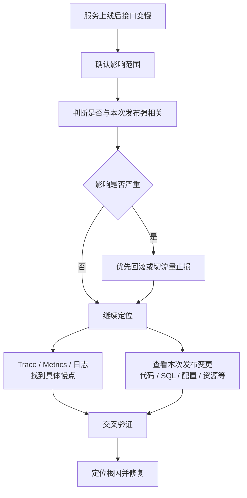

## 一、面试口述回答

如果服务是在上线之后接口突然变慢，我首先还是会**确认问题的影响范围**，比如是个别接口还是整个服务、所有请求还是部分请求、所有 Pod 还是部分 Pod 出现了异常。

然后这个场景有一个非常重要的线索，就是 **“刚刚上线”**。所以我会把异常开始的时间和发布时间做对比，如果还有新旧版本同时存在，也会直接比较新旧版本的接口耗时。如果老版本正常、新版本明显变慢，那就能比较强地判断问题和这次发布有关。

如果已经严重影响线上业务，而且具备安全回滚条件，我会优先回滚或者把流量切回旧版本，**先恢复服务，再继续分析根因**。

后续定位时，我一般会同时从两个方向进行。

一方面通过 **Trace、监控和日志** 去确认请求到底慢在哪个环节，是当前服务自身处理变慢，还是数据库、Redis、下游 RPC 等调用变慢。

另一方面会结合这次发布的变更内容去排查，包括代码逻辑、SQL、配置、依赖版本、连接池、超时重试策略以及 Pod 的资源配置等。

最后把两边的线索结合起来：比如监控发现数据库调用耗时明显增加，而这次发布刚好修改了 SQL，那么问题范围就可以快速缩小。

如果发现新旧版本都一样慢，那就说明问题未必是这次上线导致的，这时就要回到普通接口变慢的排查路径，继续检查流量、公共依赖、Pod、Node 等因素。

所以整体思路就是：

> **先定界，再判断是否与本次发布强相关；影响严重先回滚止损；然后通过监控和日志定位慢点，同时对照本次版本变更，最终通过两边线索交叉验证定位根因。**

---

# 二、整体排查思路

这道题和普通的“接口突然变慢”很像，但多了一个非常重要的前提：

> **问题发生在服务上线之后。**

因此排查时不能忽略这个线索。

普通接口变慢，我们更多是从系统现象出发，一层一层缩小范围。

而这道题除了这条路径之外，还可以利用：

> **上线前 vs 上线后、新版本 vs 老版本**

进行快速对比。

---

## 三、第一步：先确认问题范围

不要一上来就直接看代码改了什么。

首先还是要知道：

- 是某几个接口慢，还是整个服务都慢；
- 是所有请求都慢，还是偶发慢；
- 是所有 Pod 都慢，还是只有部分 Pod；
- 问题是什么时候开始出现的。

这一阶段的目的只有一个：

> **先确定问题到底有多大，以及问题集中在哪里。**

---

## 四、第二步：判断是否真的和本次上线有关

题目虽然说“上线后接口变慢”，但这只是一个线索，还需要验证。

最直接的方法就是做时间和版本对比：

```text
发布时间
   ↓
接口 RT 开始上涨
```

如果二者高度重合，就要优先怀疑本次发布。

如果是滚动发布或灰度发布，还可以进一步比较：

```text
同样的流量
    │
    ├── 老版本 Pod → 正常
    │
    └── 新版本 Pod → 很慢
```

这种情况下，问题基本就可以优先锁定到：

> **本次发布带来的变化。**

反过来，如果老版本和新版本都慢，就不能一直盯着代码发布，要考虑是不是数据库、流量、网络或其他公共因素恰好同时出现了问题。

---

## 五、第三步：影响严重时先恢复服务

线上故障排查不仅要考虑：

> 为什么慢？

还要考虑：

> 现在怎么最快恢复？

如果能够明确看到：

```text
老版本正常
新版本异常
```

并且问题已经严重影响业务，那么通常优先考虑：

```text
停止继续发布
      ↓
回滚 / 切回旧版本
      ↓
恢复线上服务
      ↓
继续分析根因
```

这里体现的是一个很重要的线上故障处理原则：

> **先止损，再追根因。**

当然，回滚本身也需要考虑安全性，例如是否涉及不可逆的数据结构或协议变化，不能机械地认为所有问题都可以直接回滚。

---

## 六、第四步：两条线同时定位问题

确认问题和版本相关以后，不建议直接开始翻所有代码 Diff。

更高效的方法是同时走两条线。



### 1. 从运行现象找“哪里慢”

通过 Trace、监控和日志，先回答：

> **请求的时间到底花在哪里？**

可能最终发现：

- 当前服务自己的处理耗时变高；
- 数据库调用变慢；
- Redis 调用变慢；
- 某个下游 RPC 变慢。

这一阶段不是直接找哪一行代码，而是先把问题范围缩小。

---

### 2. 从发布内容找“哪里变了”

另一边再去看这次上线到底改变了什么。

重点不只是代码，还包括：

- 业务逻辑；
- SQL；
- 配置；
- 连接池参数；
- 超时和重试策略；
- SDK 或依赖版本；
- CPU、内存等 Pod 资源配置。

因为：

> **上线变更并不等于代码变更。**

很多性能问题实际上来自配置或者运行环境变化。

---

## 七、第五步：把“哪里慢”和“哪里变了”对应起来

这是整个排查过程中最关键的一步。

例如监控告诉我们：

```text
上线前：

数据库调用 30ms

上线后：

数据库调用 800ms
```

而发布记录又显示：

```text
本次版本修改了一条核心 SQL
```

这时候两个方向的证据就对应上了。

于是排查范围可以从：

> “整个新版本有问题”

快速缩小成：

> “重点检查这条 SQL 以及相关数据库访问逻辑。”

这就是为什么不能只看代码，也不能只看监控。

更高效的方法是：

> **运行时现象告诉我们哪里出了问题，发布变更告诉我们为什么可能出问题。**

两边结合，定位速度会非常快。

---

# 八、如果发现和版本无关怎么办

如果最终发现：

```text
老版本也慢
新版本也慢
```

或者问题在发布之前其实已经开始出现，那么就不能继续围绕这次发布排查。

此时重新回到普通接口变慢的通用路径：

```text
确认影响范围
    ↓
Trace / Metrics / 日志定位慢点
    ↓
当前服务 / 下游依赖
    ↓
所有 Pod / 部分 Pod
    ↓
Pod / Node / 数据库 / Redis / 网络
    ↓
定位根因
```

也就是说：

> **“上线”是非常强的线索，但不能把它当成结论。**

---

# 九、总结

这道题最核心的不是记住要查 CPU、数据库还是网络，而是理解这个场景多出来的一条信息：

> **问题发生在一次明确的变更之后。**

因此整个思考过程可以概括为：

```text
先定界
   ↓
判断是否与上线强相关
   ↓
严重时先回滚止损
   ↓
监控 / 日志定位“哪里慢”
   +
版本变更定位“哪里变了”
   ↓
两边交叉验证
   ↓
定位根因并修复
```

相比普通的接口变慢问题，这道题最大的特点就是：

> **充分利用“上线前后”和“新旧版本”的对比，把排查范围快速收敛到本次变更。**